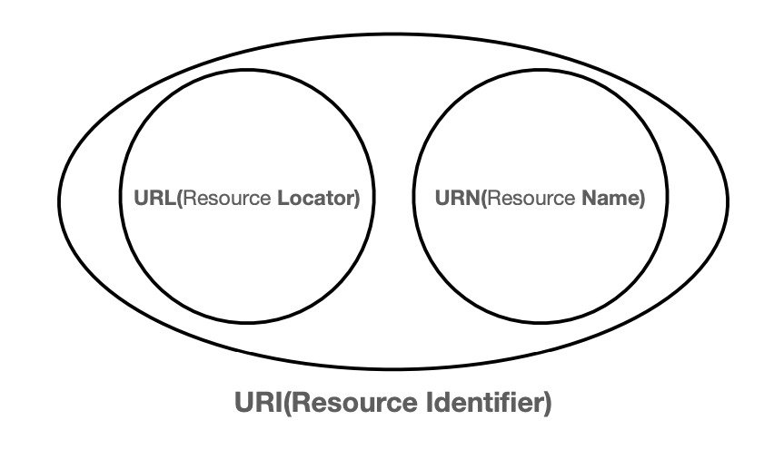
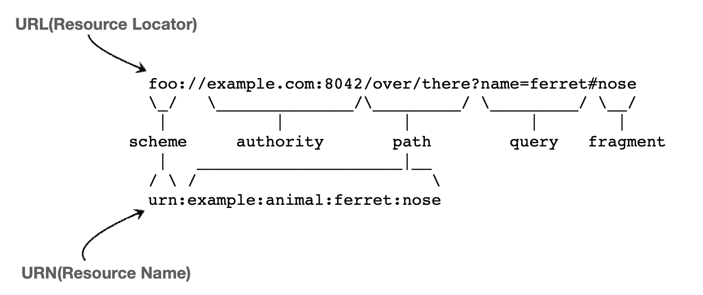

# URI

### Date: 2024.02.16

---

### URI? URL? URN?
URI는 로케이터(locator), 이름(name) 또는 둘 다 추가로 분류될 수 있다.
- 사실상 URL만 사용한다.
  

- Uniform: 리소스 식별하는 통일된 방식
- Resource: 자원, URI로 식별할 수 있는 모든 것(제한 없음)
- Identifier: 다른 항목과 구분하는데 필요한 정보

---

- URL - Locator: 리소스가 있는 위치를 지정
- URN - Name: 리소스에 이름을 부여
- 위치는 변할 수 있지만, 이름은 변하지 않는다.
- urn:isbn:8960777331 (어떤 책의 isbn URN)
- URN 이름만으로 실제 리소스를 찾을 수 있는 방법이 보편화 되지 않음

### URL 분석 예시
scheme://[userinfo@]host[:port][/path][?query][#fragment]
https://www.google.com:443/search?q=hello&hl=ko

- 프로토콜(https)
- 호스트명(www.google.com)
- 포트 번호(443)
- 패스(/search)
  - http는 80 포트, https는 443 포트를 주로 사용, 포트는 생략 가능
  - https는 http에 보안 추가 (HTTP Secure)
- 쿼리 파라미터(q=hello&hl=ko)  
  - key=value 형태
  - ?로 시작, &로 추가 가능 ?keyA=valueA&keyB=valueB
  - query parameter, query string 등으로 불림, 웹서버에 제공하는 파라미터, 문자 형태

