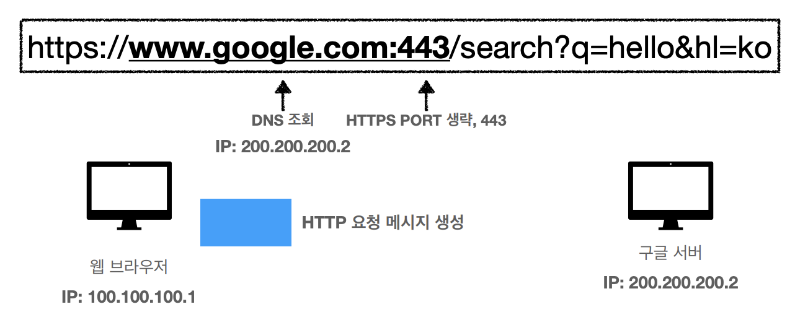
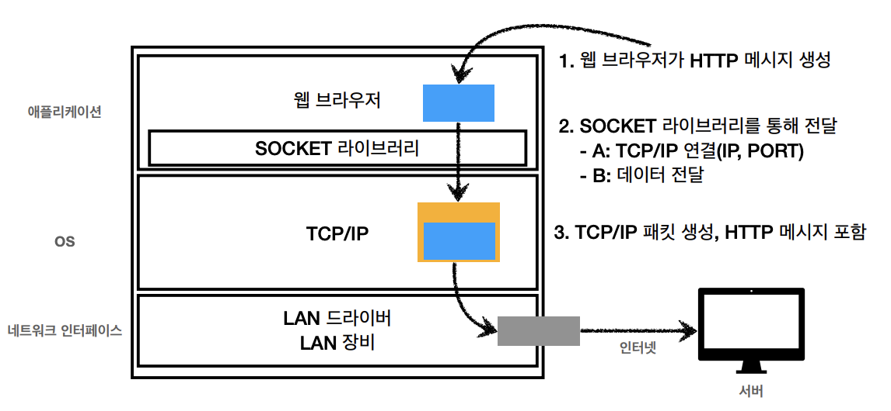
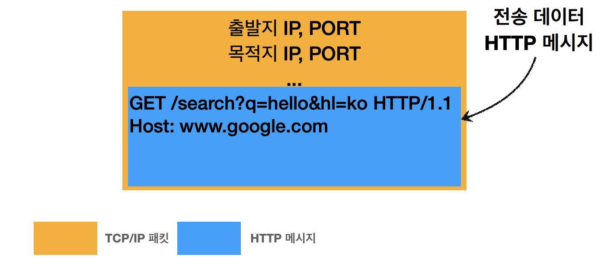
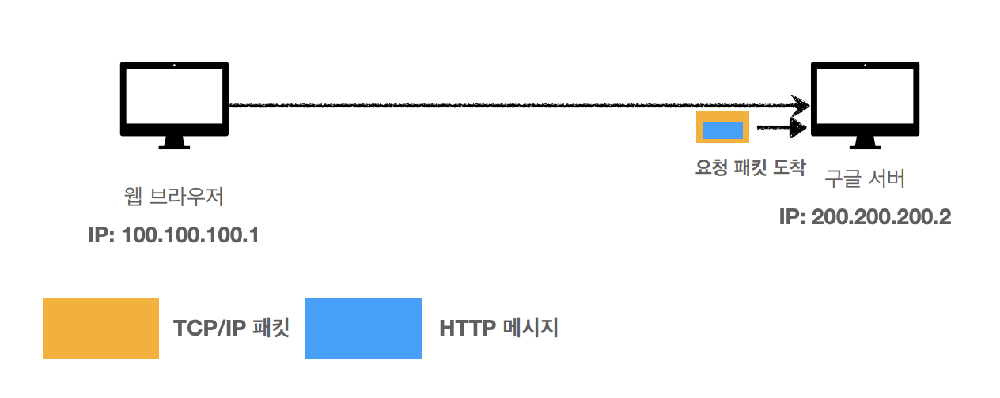
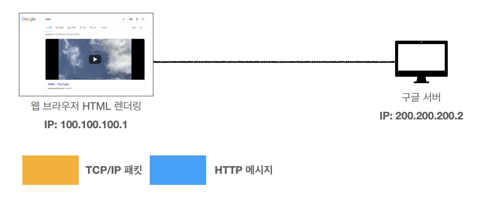

# Web browser request flow

### Date: 2024.02.16

---

### 



### HTTP 요청 메세지 전송
```http
GET /search?q=hello&hl=ko HTTP/1.1
Host: www.google.com
```


### 패킷 전달




### 패킷 도착 후 렌더링
```http
HTTP/1.1 200 OK
Content-Type: text/html;charset=UTF-8
Content-Length: 3423
<html>
 <body>...</body>
</html>
```

